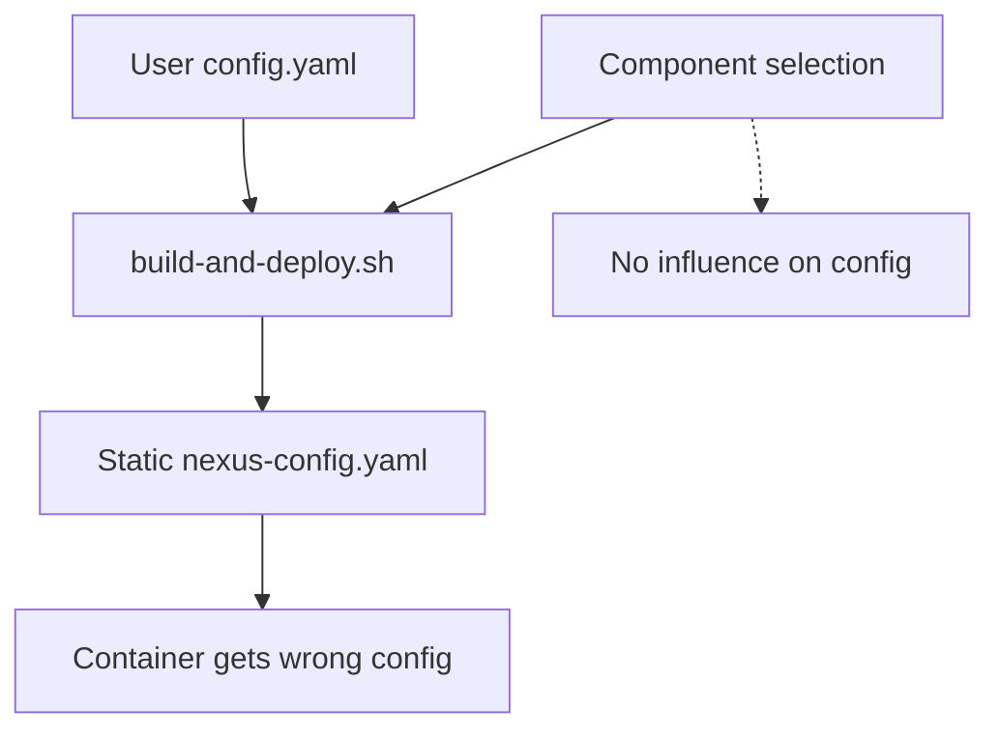
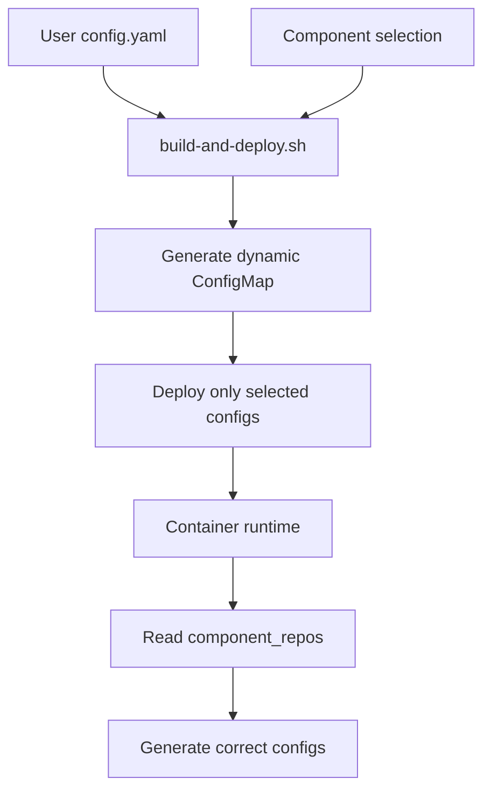

# AI DevKit Pod Configurator - Current State Analysis

## Executive Summary

This document provides a comprehensive analysis of the current system state in the context of the refactoring objectives outlined in JOURNAL.md. The system currently suffers from significant architectural issues including:

1. **Language-specific configuration leakage** throughout base scripts
2. **No component isolation** - all configurations deployed regardless of selection
3. **Broken configuration flow** from host to container
4. **Hardcoded repository URLs** that don't match user configurations

## Current Architecture Problems

### 1. Language-Specific Configuration in Base Scripts

#### lib/entrypoint-repo-setup.sh
- **VIOLATION**: Contains hardcoded functions for EVERY language/tool:
  - `setup_pip_repos()` (lines 50-83)
  - `setup_npm_repos()` (lines 85-108)
  - `setup_go_repos()` (lines 110-136)
  - `setup_maven_repos()` (lines 138-202)
  - `setup_cargo_repos()` (lines 204-227)
  - `setup_gem_repos()` (lines 229-252)
- **Impact**: Base system tightly coupled to specific languages
- **Lines of language-specific code**: ~200+ lines

#### lib/repository-config.sh
- **VIOLATION**: Contains generation functions for all package managers:
  - `generate_pip_config()` (lines 180-200)
  - `generate_npm_config()` (lines 202-215)
  - `generate_maven_settings()` (lines 217-267)
  - `generate_cargo_config()` (lines 269-280)
  - `generate_go_env()` (lines 282-295)
  - `generate_sbt_repositories()` (lines 297-314)
- **Impact**: Cannot add new languages without modifying base scripts
- **Lines of language-specific code**: ~130+ lines

#### docker/entrypoint.base.sh
- **VIOLATION**: Hardcoded environment variable preservation for specific tools (lines 138-147):
  ```bash
  [ -n "$PIP_INDEX_URL" ] && ENV_PRESERVE="$ENV_PRESERVE && export PIP_INDEX_URL='$PIP_INDEX_URL'"
  [ -n "$NPM_CONFIG_REGISTRY" ] && ENV_PRESERVE="$ENV_PRESERVE && export NPM_CONFIG_REGISTRY='$NPM_CONFIG_REGISTRY'"
  [ -n "$GOPROXY" ] && ENV_PRESERVE="$ENV_PRESERVE && export GOPROXY='$GOPROXY'"
  [ -n "$CARGO_REGISTRIES_CRATES_IO_PROTOCOL" ] && ...
  [ -n "$SBT_OPTS" ] && ENV_PRESERVE="$ENV_PRESERVE && export SBT_OPTS='$SBT_OPTS'"
  ```
- **Impact**: Must modify base entrypoint for each new language

### 2. No Component Isolation

#### kubernetes/deployment.yaml
- **VIOLATION**: Mounts ALL configuration files regardless of selected components (lines 53-78):
  ```yaml
  - name: cargo-config
    mountPath: /home/devuser/.cargo/config.toml
  - name: pip-config
    mountPath: /home/devuser/.config/pip/pip.conf
  - name: npm-config
    mountPath: /home/devuser/.npmrc
  - name: maven-settings
    mountPath: /home/devuser/.m2/settings.xml
  - name: sbt-repositories
    mountPath: /home/devuser/.sbt/repositories
  - name: conda-config
    mountPath: /home/devuser/.condarc
  - name: gradle-config
    mountPath: /home/devuser/.gradle/gradle.properties
  - name: gem-config
    mountPath: /home/devuser/.gemrc
  ```
- **Impact**: Container bloated with unused configurations
- **Evidence**: User selected only Python & Node.js but container has .cargo, .sbt, .gradle, .gemrc, etc.

#### kubernetes/nexus-config.yaml
- **VIOLATION**: Hardcoded ConfigMap with ALL language configurations:
  - pip.conf (lines 7-10)
  - npmrc (lines 12-13)
  - cargo-config.toml (lines 15-20)
  - settings.xml (lines 22-35)
  - repositories (lines 37-40)
  - condarc (lines 42-49)
  - gradle.properties (lines 51-52)
  - gemrc (lines 54-57)
- **Impact**: ConfigMap always contains all configurations, not dynamic

### 3. Broken Configuration Flow

#### Configuration Mismatch Example
- **User's config.yaml** (host):
  ```yaml
  component_repos:
    PYTHON_3_11:
      - url: "http://pop-os:8090"  # python-group
      - url: "http://pop-os:8084"  # python-hosted
  ```

- **Generated pip.conf** (container):
  ```ini
  [global]
  index-url = http://host.lima.internal:8081/repository/pypi-proxy/simple
  trusted-host = host.lima.internal
  ```

- **Problems**:
  1. Wrong host: `host.lima.internal` instead of `pop-os`
  2. Wrong port: `8081` instead of `8090`
  3. Wrong path: `/repository/pypi-proxy` instead of configuration from config.yaml
  4. Configuration is hardcoded in nexus-config.yaml, not generated from user's config

### 4. Configuration Generation Issues

#### Current Flow (BROKEN):
```
1. User selects components in TUI
2. build-and-deploy.sh generates components_import.sh
3. Kubernetes deploys with nexus-config.yaml (HARDCODED)
4. Container gets wrong configuration
```

#### Missing Link:
- No mechanism to translate user's `config.yaml` → container configurations
- nexus-config.yaml is static, not generated from user preferences
- Component selections don't influence configuration generation

### 5. Component YAML Structure Analysis

#### Example: python-3.11.yaml
```yaml
installation:
  repos:
    enabled: true
    format: "pypi"
    config_type: "both"
    config_file: "pip.conf"
    config_path: "~/.config/pip/"
    recommended: [...]  # Not used, just recommendations
entrypoint_setup: |
  # Hardcoded configuration generation
  if [ -n "$PIP_INDEX_URL" ]; then
    echo "[global]" > /home/devuser/.config/pip/pip.conf
    echo "index-url = ${PIP_INDEX_URL}" >> ...
```

**Problems**:
- Configuration logic in YAML's `entrypoint_setup` relies on environment variables
- No mechanism to read from mounted `component_repos` configuration
- Each component has duplicated configuration logic

### 6. Missing Components

#### What's Missing:
1. **Dynamic ConfigMap Generator**: Should create nexus-config.yaml from user's config.yaml
2. **Component Configuration Loader**: Should read component_repos at runtime
3. **Host Address Translator**: Should map localhost → correct container-accessible host
4. **Component Isolation Mechanism**: Should only deploy selected component configs

#### What Exists but Doesn't Work:
1. **lib/entrypoint-repo-setup.sh**: Tries to setup repos but:
   - Looks for `/config/component_repos.yaml` which doesn't exist
   - Uses `INSTALLED_COMPONENTS` env var which is never set
   - Has all language logic hardcoded

2. **Component repo definitions**: Each component YAML has `installation.repos` but:
   - Only contains "recommended" repos
   - Not connected to actual configuration generation
   - Not reading from user's config.yaml

## File Inventory

### Base Scripts with Language-Specific Code
1. `lib/entrypoint-repo-setup.sh` - 295 lines, ~250 language-specific
2. `lib/repository-config.sh` - 393 lines, ~200 language-specific
3. `docker/entrypoint.base.sh` - 160 lines, ~10 language-specific
4. `kubernetes/deployment.yaml` - 357 lines, ~50 language-specific mounts
5. `kubernetes/nexus-config.yaml` - 75 lines, ALL language-specific

### Component Files (Sample)
- `components/languages/python-3.11.yaml` - Has config generation in entrypoint_setup
- `components/languages/nodejs-20.yaml` - Similar structure
- Total: ~30 language component files

### Configuration Files Generated
- `.build-temp/entrypoint.sh` - Generated but includes ALL component setups
- `.build-temp/components_import.sh` - Lists selected components but not used for config

## Impact Assessment

### Current State Consequences:
1. **Bloat**: Every container has configurations for ~15 languages/tools
2. **Conflicts**: Multiple tools trying to configure same files
3. **Maintenance**: Must modify 5+ files to add a new language
4. **Correctness**: Configurations don't match user settings
5. **Security**: Exposing unnecessary configuration files

### Lines of Code to Refactor:
- **Remove from base**: ~460 lines of language-specific code
- **Move to components**: ~30 component files need restructuring
- **New code needed**: ~200 lines for proper configuration flow

## Configuration Flow Analysis

### Current Flow (BROKEN):


### Target Flow:


## Priority Refactoring Tasks

### Phase 1: Remove Language-Specific Logic (CRITICAL)
1. Delete all language functions from `lib/entrypoint-repo-setup.sh`
2. Delete all generation functions from `lib/repository-config.sh`
3. Remove language-specific env vars from `docker/entrypoint.base.sh`
4. Remove hardcoded mounts from `kubernetes/deployment.yaml`

### Phase 2: Implement Component Isolation (HIGH)
1. Create component-specific configuration generators
2. Modify build to stage only selected component configs
3. Generate dynamic ConfigMap from user's config.yaml
4. Mount only necessary configuration files

### Phase 3: Fix Configuration Flow (HIGH)
1. Pass user's component_repos to container
2. Implement runtime configuration generation
3. Add host address translation logic
4. Connect component YAMLs to configuration system

### Phase 4: Validation (MEDIUM)
1. Test each component in isolation
2. Verify configurations match user settings
3. Ensure no leaked configurations

## Technical Debt Metrics

- **Coupling Score**: 9/10 (Extreme coupling between base and languages)
- **Configuration Correctness**: 2/10 (Wrong hosts, ports, paths)
- **Isolation Score**: 0/10 (No isolation at all)
- **Maintainability**: 3/10 (Must modify multiple files for changes)
- **Lines of Misplaced Code**: ~460 lines

## Recommendations

### Immediate Actions:
1. **Stop**: Adding any more language-specific code to base scripts
2. **Document**: Mark all violation points in code with TODO comments
3. **Plan**: Create detailed refactoring plan with milestones

### Long-term Strategy:
1. **Principle**: "Components own their configuration"
2. **Pattern**: Plugin architecture for components
3. **Goal**: Zero language-specific code in base system

## Appendix: Evidence

### Evidence of All Configs Being Deployed:
From user's container listing:
```
~/.cargo/config.toml    # User didn't select Rust
~/.sbt/repositories      # User didn't select Scala
~/.gradle/               # User didn't select Gradle
~/.condarc              # User didn't select Conda
~/.gemrc                # User didn't select Ruby
```

### Evidence of Wrong Configuration:
User's validation test output:
```
Checking pip configuration:
global.index-url='http://host.lima.internal:8081/repository/pypi-proxy/simple'
global.trusted-host='host.lima.internal'

Verifying Nexus configuration:
⚠ No Nexus repository found in pip configuration
```
Should be: `http://pop-os:8090` per user's config.yaml

### Evidence of Hardcoding:
From `kubernetes/nexus-config.yaml`:
```yaml
pip.conf: |
  [global]
  index-url = http://host.lima.internal:8081/repository/pypi-proxy/simple
```
This is static, not generated from user's configuration.

---

*This analysis provides a baseline for the refactoring effort. Reference this document along with JOURNAL.md after context compaction to maintain continuity.*