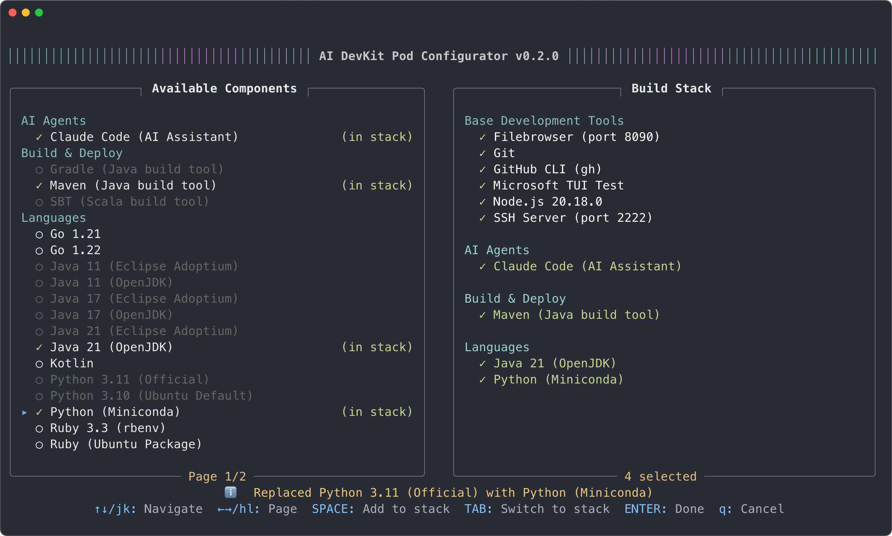
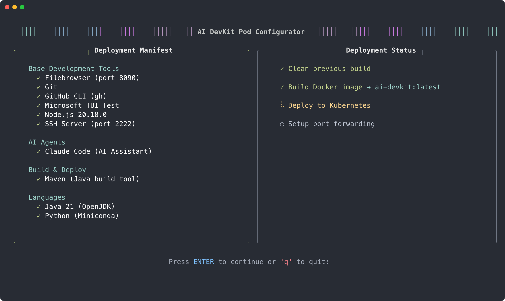
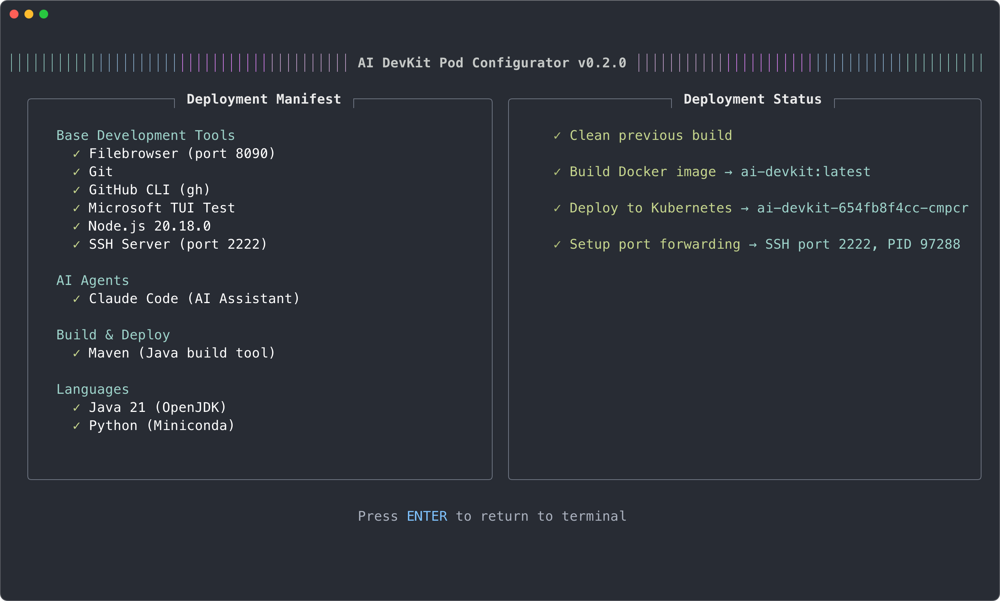
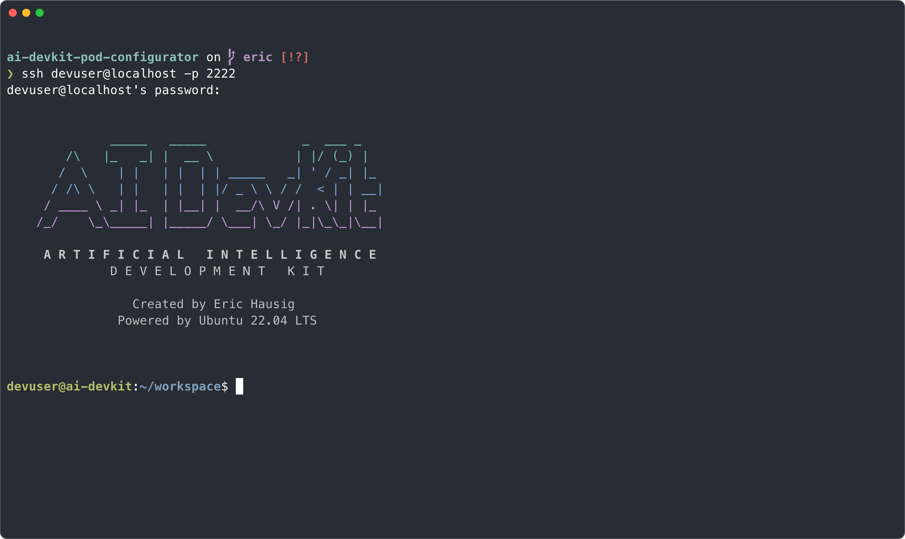

# AI DevKit Pod Configurator

A powerful, modular system for creating containerized development environments in Kubernetes with support for multiple programming languages, build tools, and AI coding assistants.


## 📖 Documentation

- **[Architecture Overview](docs/architecture.md)** - System design and component structure
- **[Creating Components](docs/components.md)** - Build your own custom components
- **[Theme Customization](docs/themes.md)** - Customize the TUI appearance
- **[Troubleshooting](docs/troubleshooting.md)** - Common issues and solutions
- **[Roadmap](docs/roadmap.md)** - Future plans and enhancements

### For Contributors
- **[Developer Guide](docs/developer.md)** - Contributing code and creating pull requests
- **[Maintainer Guide](docs/maintainer.md)** - Release management and repository maintenance

## 🎯 Overview

AI DevKit Pod Configurator provides a beautiful TUI (Terminal User Interface) for selecting and deploying customized development environments in Kubernetes. Each environment is built from a minimal Ubuntu base with only the components you need.

### Key Features

- 🎨 **Beautiful TUI** - Interactive component selection with theme support
- 🧩 **Modular Architecture** - Add only what you need: languages, tools, AI assistants
- 🔧 **Language Support** - Python, Java, Go, Rust, Ruby, Scala, Kotlin, Node.js, and more
- 🤖 **AI Integration** - Claude Code with Team Topologies-based autonomous development
- 📦 **Build Tools** - Maven, Gradle, SBT with optional Nexus proxy support
- 🧪 **Testing Tools** - Microsoft TUI Test for terminal application testing
- 💾 **Persistent Storage** - Your code and configuration persist across restarts
- 🌐 **Web File Manager** - Built-in Filebrowser for easy file management
- 🔒 **Secure** - Runs as non-root user with proper isolation

## 📸 Screenshots

### Component Selection Interface

*Interactive TUI for selecting development tools and languages*

### Deployment Status Dashboard

*Real-time deployment progress with animated status indicators*


*Automatic port forwarding for easy connectivity*

### Development Environment

*Inside the configured container with your selected tools ready to use*

## 🚀 Quick Start

### Prerequisites

- Kubernetes cluster (k3s, minikube, Colima, or any Kubernetes distribution)
- kubectl configured to access your cluster
- Container tool: **Docker**, **nerdctl**, or **Podman** (automatically detected)
- `yq` and `jq` for YAML/JSON processing
- For macOS users: [Colima](https://github.com/abiosoft/colima) is recommended
- For Linux/K3s users: **nerdctl** is recommended for seamless integration
- For other Linux users: Docker or Podman work well

### macOS Quick Setup with Colima

```bash
# Install dependencies
brew install colima kubectl yq jq

# Start Colima with Kubernetes
colima start --kubernetes --cpu 4 --memory 8

# Verify setup
kubectl get nodes
```

### Ubuntu/Linux Quick Setup with K3s

```bash
# Install dependencies
sudo apt-get update
sudo apt-get install -y curl

# Install kubectl
curl -LO "https://dl.k8s.io/release/$(curl -L -s https://dl.k8s.io/release/stable.txt)/bin/linux/amd64/kubectl"
sudo install -o root -g root -m 0755 kubectl /usr/local/bin/kubectl

# Install yq
sudo wget -qO /usr/local/bin/yq https://github.com/mikefarah/yq/releases/latest/download/yq_linux_amd64
sudo chmod +x /usr/local/bin/yq

# Install jq
sudo apt-get install -y jq

# Install K3s (lightweight Kubernetes)
curl -sfL https://get.k3s.io | sh -

# Configure kubectl for K3s
mkdir -p ~/.kube
sudo cp /etc/rancher/k3s/k3s.yaml ~/.kube/config
sudo chown $USER:$USER ~/.kube/config

# RECOMMENDED: Install nerdctl for seamless K3s integration
wget https://github.com/containerd/nerdctl/releases/download/v1.7.2/nerdctl-1.7.2-linux-amd64.tar.gz
sudo tar -xzf nerdctl-1.7.2-linux-amd64.tar.gz -C /usr/local/bin
rm nerdctl-1.7.2-linux-amd64.tar.gz

# Optional: Create docker alias for compatibility
sudo ln -s /usr/local/bin/nerdctl /usr/local/bin/docker

# Verify setup
kubectl get nodes
nerdctl version  # or docker version if aliased

# Alternative: Install Docker or Podman if preferred
# sudo apt-get install -y docker.io  # for Docker
# sudo apt-get install -y podman      # for Podman
```

### Cross-Platform Support

The AI DevKit now supports multiple container runtime environments:

- **Colima** (macOS) - VM-based Docker/Kubernetes
- **K3s** (Linux) - Lightweight Kubernetes distribution
- **Docker Desktop** (macOS/Windows) - Native Docker with Kubernetes
- **Generic containerd** - Standard container runtime
- **Other Kubernetes distributions** - minikube, kind, etc.

The build system automatically detects your runtime environment and adapts accordingly.

### Basic Usage

```bash
# Clone the repository
git clone https://github.com/ehausig/ai-devkit-pod-configurator.git
cd ai-devkit-pod-configurator

# Make scripts executable
chmod +x *.sh

# Step 1: Configure container runtime (REQUIRED on first run)
./configure-container-runtime.sh
# This will:
#   - Detect available container tools (docker, nerdctl, podman)
#   - Identify your Kubernetes runtime (k3s, colima, etc.)
#   - Recommend optimal configurations
#   - Save your preferences

# Step 2: (Optional) Configure git credentials for automatic injection
./configure-git-host.sh

# Step 3: Build and deploy with interactive component selection
./build-and-deploy.sh

# Access your development environment
ssh devuser@localhost -p 2222
# Password: devuser
```

## 🎮 Using the Component Selector

When you run `./build-and-deploy.sh`, an interactive TUI appears:

- **↑/↓** or **j/k** - Navigate components
- **←/→** or **h/l** - Switch pages
- **SPACE** - Select/deselect component
- **TAB** - Switch between catalog and selected items
- **ENTER** - Build with selected components
- **q** - Quit

The selector shows:
- ✓ Selected components
- ○ Available components
- Dependencies and conflicts
- Real-time build status with animations

## 🔐 Git Configuration

Configure git credentials once on your host machine:

```bash
./configure-git-host.sh
```

This creates an isolated git configuration that's automatically injected into your containers, including:
- Git user name and email
- GitHub Personal Access Token
- GitHub CLI authentication

## 📁 Accessing Your Environment

### SSH Access

After deployment completes, the build script automatically sets up port forwarding:

```bash
# Connect to your development environment
ssh devuser@localhost -p 2222
# Password: devuser
```

### Web File Manager

Access the built-in Filebrowser at [http://localhost:8090](http://localhost:8090)
- Default credentials: admin/admin (change after first login!)
- Upload/download files through the web interface
- Edit files directly in the browser

## 🧩 Available Components

### Programming Languages
- **Python** - System (3.10), 3.11, or Miniconda versions
- **Node.js** - 20.x (LTS) and 22.x (Current)
- **Java** - OpenJDK or Adoptium (11, 17, 21)
- **Go** - Versions 1.21 and 1.22
- **Rust** - Stable and nightly channels
- **Ruby** - System or 3.3
- **Scala** - 2.13 and 3.x
- **Kotlin** - Latest version

### Build Tools
- **Maven** - Java project management
- **Gradle** - Build automation
- **SBT** - Scala build tool

### AI Assistants
- **Claude Code** - Advanced AI coding assistant with Team Topologies-based autonomous development system (see [Claude Code Documentation](components/agents/claude-code/README.md))

### Testing Tools
- **Microsoft TUI Test** - End-to-end terminal testing framework

## 🤖 Claude Code Integration

The AI DevKit includes Claude Code with a sophisticated autonomous development system based on Team Topologies principles:

### Team Structure
- **Stream-Aligned Team**: Feature Developer, QA Engineer
- **Platform Team**: Platform Engineer, Database Engineer
- **Enabling Team**: API Designer, Security Specialist, Performance Engineer, Solution Architect, Cloud Architect, Data Architect
- **Complicated Subsystem Team**: Integration Specialist, Algorithm Developer

### Key Features
- **Kanban-based workflow** - Track work through cards and states
- **Autonomous orchestration** - Product Manager (main thread) coordinates teams
- **Deterministic handoffs** - Clear state transitions via JOURNAL.md
- **No hooks required** - Explicit orchestration without relying on hooks
- **Requirements-driven** - Start with PROMPT.md for project specifications

### Quick Start with Claude Code
```bash
# Inside your container, create requirements
cat > ~/workspace/PROMPT.md << 'EOF'
# Project: Todo API

Create a REST API with CRUD operations for todos
EOF

# Initialize autonomous development
/init-autonomous

# Monitor progress
/show-journal
/kanban-status
```

## 🎨 Theme Support

The TUI supports multiple themes to match your preference:

```bash
# Use built-in themes
AI_DEVKIT_THEME=matrix ./build-and-deploy.sh
AI_DEVKIT_THEME=ocean ./build-and-deploy.sh
AI_DEVKIT_THEME=neon ./build-and-deploy.sh
```

Available themes: `default`, `dark`, `matrix`, `ocean`, `minimal`, `neon`

## 🧹 Disk Management

### Cross-Platform Container Cleanup

The AI DevKit includes a smart cleanup script that automatically detects your container runtime and performs appropriate cleanup operations.

**The Problem**: Container runtimes accumulate unused images, containers, and volumes over time, leading to:
- "No space left on device" errors
- Image pull failures
- Build failures
- Slow performance

**The Solution**: The `cleanup-runtime.sh` script provides cross-platform cleanup:

```bash
# Check what can be cleaned (dry run) - works on any runtime
./cleanup-runtime.sh --check

# Clean up disk space with runtime detection
./cleanup-runtime.sh

# Force cleanup without prompts
./cleanup-runtime.sh --force
```

**Runtime-Specific Features**:
- **Colima**: VM disk cleanup, overlay2 orphan removal, journal cleanup
- **K3s**: containerd cleanup, system service management
- **Docker Desktop**: Docker system cleanup with UI integration
- **Generic**: Universal container cleanup commands

**Advanced Options**:
```bash
# Colima-specific overlay2 cleanup (use with caution)
./cleanup-runtime.sh --overlay2

# Safe mode (skip risky operations)
./cleanup-runtime.sh --safe
```

**⚠️ CRITICAL WARNINGS**:
- **Colima users**: The `--overlay2` option can be risky - use only when necessary
- **K3s users**: Cleanup requires sudo permissions for containerd access
- **All platforms**: System images required for Kubernetes are automatically protected

**Complete Reset Options**:
```bash
# Colima (macOS)
colima delete
colima start --kubernetes --cpu 4 --memory 8 --disk 100

# K3s (Linux)
/usr/local/bin/k3s-uninstall.sh
curl -sfL https://get.k3s.io | sh -

# Docker Desktop
# Use "Reset to factory defaults" from Docker Desktop settings
```

## 📚 Creating Custom Components

Components are self-contained YAML files that define how to install and configure tools. See [Creating Components](docs/components.md) for detailed instructions.

### Basic Component Structure

```yaml
id: MY_COMPONENT
name: My Component Name
version: "1.0.0"
group: component-group
requires: []
description: What this component does
command_permissions:
  allow:
    - "Bash(my-tool:*)"
installation:
  dockerfile: |
    # Installation commands
    RUN apt-get update && apt-get install -y my-tool
```

### Component Documentation (Optional)

Components can include markdown documentation that gets injected into AI assistant prompts:

```markdown
# components/category/my-component.md

#### My Component Name

**Getting Started**:
```bash
# How to use this component
my-tool --help
```

## 🛠️ Advanced Features

### Container Runtime Configuration

The AI DevKit uses a configuration-first approach to manage container tools and runtimes:

```bash
# Configure your runtime (required on first run)
./configure-container-runtime.sh
```

This creates `~/.ai-devkit/config.yaml` with your preferences:
- **Container build tool**: docker, nerdctl, or podman
- **Kubernetes runtime**: k3s, colima, docker-desktop, etc.
- **Import method**: direct (nerdctl+k3s), none (docker-desktop), or save-load

Benefits:
- **Explicit control**: Choose which tool to use when multiple are available
- **Optimal pairing**: Get recommendations for best tool/runtime combinations
- **Faster builds**: No repeated detection on every run
- **Clear configuration**: See exactly what will be used

To reconfigure, simply run the configuration script again.

### Container Tool and K3s Image Management

#### Recommended: nerdctl with K3s
When using nerdctl, images are built directly into K3s's containerd - no transfer needed:
```bash
# Build directly into K3s containerd
nerdctl build -t ai-devkit:latest .
# or with docker alias
docker build -t ai-devkit:latest .

# Images are immediately available to K3s
nerdctl -n k8s.io images | grep ai-devkit
```

#### Alternative: Podman/Docker with K3s
When using Podman or Docker with K3s, images must be transferred:
```bash
# Automatic import during build
./build-and-deploy.sh  # Handles import automatically

# Manual import if needed
./import-image-to-k3s.sh ai-devkit:latest

# Check image availability
sudo k3s ctr -n k8s.io images list | grep ai-devkit
```

### Command Permissions

Components can specify Claude Code command permissions that get aggregated:

```yaml
command_permissions:
  allow:
    - "Bash(npm:*)"
    - "Bash(node:*)"
    - "Read(*.js)"
  deny:
    - "Bash(rm -rf:*)"
```

### Nexus Repository Proxy

If you have a Nexus repository manager running locally, the build system automatically detects and configures package managers to use it:

```bash
# Start Nexus (optional)
docker run -d -p 8081:8081 --name nexus sonatype/nexus3

# Build will auto-detect and use Nexus for:
# - npm packages
# - Python packages (pip)
# - Maven artifacts
# - Go modules
# - APT packages
```

### Pre-build Scripts

Components can include pre-build scripts for complex setup:
- Generate configuration files
- Download additional resources
- Create documentation aggregates
- Set up component-specific structures
- Process command permissions for Claude Code

### Dependency Management

The build system includes:
- Topological sorting of components by dependencies
- Mutual exclusion groups (e.g., only one Python version)
- Automatic dependency validation
- Clear error messages for conflicts

## 🤝 Contributing

We welcome contributions! Please see our [Developer Guide](docs/developer.md) for information on:
- Setting up your development environment
- Creating feature branches
- Writing tests
- Submitting pull requests

For maintainers, see the [Maintainer Guide](docs/maintainer.md) for release procedures.

## 🐛 Troubleshooting

### Common Issues

1. **Permission Denied**: Make scripts executable with `chmod +x *.sh`
2. **Kubernetes Connection**: Ensure your cluster is running and `kubectl` is configured
3. **Build Failures**: Check `build-and-deploy.log` for detailed error messages
4. **Disk Space**: Use `cleanup-colima.sh` to free up space in Colima
5. **Missing Dependencies**: Install `yq` and `jq` with your package manager

See the [Troubleshooting Guide](docs/troubleshooting.md) for comprehensive solutions.

## 📋 System Requirements

### Minimum Requirements
- 4 CPU cores
- 8GB RAM
- 20GB disk space
- Kubernetes 1.20+

### Recommended
- 6+ CPU cores
- 12GB+ RAM
- 50GB+ disk space
- Fast internet connection for package downloads

## 💖 Support This Project

If you find AI DevKit Pod Configurator useful, please consider supporting its development:

☕ **[Buy me a coffee](https://buymeacoffee.com/ehausig)**

Your support helps maintain and improve this project. Thank you! 🙏

## 📄 License

This project is licensed under the MIT License - see the [LICENSE](LICENSE) file for details.

## 🙏 Acknowledgments

This project builds upon excellent work from these organizations and projects:

### Core Technologies

- **[Ubuntu](https://ubuntu.com)** - The base operating system (22.04 LTS)
  - Copyright © Canonical Ltd.
  
- **[Kubernetes](https://kubernetes.io)** - Container orchestration platform
  - Originally designed by Google, now maintained by the Cloud Native Computing Foundation

- **[Microsoft TUI Test](https://github.com/microsoft/tui-test)** - End-to-end terminal testing framework
  - Built and maintained by Microsoft
  - Provides rich API for testing terminal applications across platforms

### Development Tools

- **[Docker](https://www.docker.com)** - Container platform
- **[Colima](https://github.com/abiosoft/colima)** - Container runtime for macOS
- **[Git](https://git-scm.com)** - Version control system
- **[GitHub CLI](https://cli.github.com)** - GitHub's official command line tool
- **[Filebrowser](https://filebrowser.org)** - Web-based file management
- **[Claude Code](https://claude.ai)** - AI coding assistant by Anthropic

### Languages and Runtimes

All programming language implementations retain their respective copyrights and licenses:
- Python, Node.js, Java (OpenJDK), Go, Rust, Ruby, and others

### Special Thanks

- The open source community for continuous improvements and contributions
- All beta testers who provided valuable feedback
- Contributors who help improve this project

---

Created with ❤️ by [Eric Hausig](https://github.com/ehausig)
