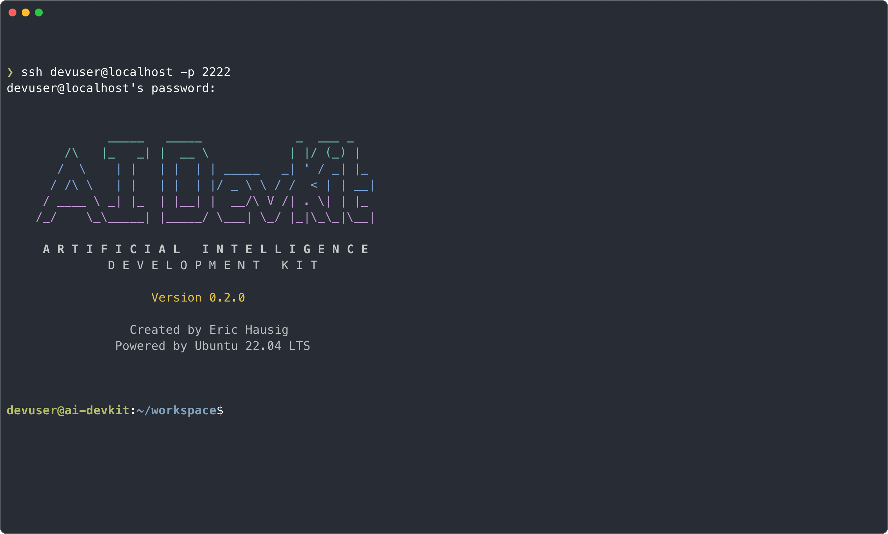

# AI DevKit Pod Configurator

A powerful, modular system for creating containerized development environments in Kubernetes with support for multiple programming languages, build tools, and AI coding assistants.


## 📸 Screenshots

### Component Selection Interface

*Interactive TUI for selecting development tools and languages*

### Deployment Status Dashboard

*Real-time deployment progress with animated status indicators*

### Development Environment

*Inside the configured container with your selected tools ready to use*

## 🚀 Quick Start

```bash
# Clone the repository
git clone https://github.com/ehausig/ai-devkit-pod-configurator.git
cd ai-devkit-pod-configurator

# Make scripts executable
chmod +x *.sh

# (Optional) Configure git credentials for automatic injection
./configure-git-host.sh

# Build and deploy with interactive component selection
./build-and-deploy.sh

# Access your development environment
ssh devuser@localhost -p 2222
# Password: devuser
```

## 🎯 Overview

AI DevKit Pod Configurator provides a beautiful TUI (Terminal User Interface) for selecting and deploying customized development environments in Kubernetes. Each environment is built from a minimal Ubuntu base with only the components you need.

### Key Features

- 🎨 **Beautiful TUI** - Interactive component selection with theme support
- 🧩 **Modular Architecture** - Add only what you need: languages, tools, AI assistants
- 🤖 **AI Assistant Support** - Optional Claude Code integration
- 🔧 **Language Support** - Python, Java, Go, Rust, Ruby, Scala, Kotlin, and more
- 📦 **Build Tools** - Maven, Gradle, SBT with optional Nexus proxy support
- 🧪 **TUI Testing** - Microsoft TUI Test pre-installed for testing terminal apps
- 💾 **Persistent Storage** - Your code and configuration persist across restarts
- 🌐 **Web File Manager** - Built-in Filebrowser for easy file management
- 🔒 **Secure** - Runs as non-root user with proper isolation

## 📋 Prerequisites

- Kubernetes cluster (k3s, minikube, Colima, or any Kubernetes distribution)
- kubectl configured to access your cluster
- Docker or compatible container runtime
- For macOS users: [Colima](https://github.com/abiosoft/colima) is recommended

### macOS Quick Setup with Colima

```bash
# Install Colima
brew install colima kubectl

# Start Colima with Kubernetes
colima start --kubernetes --cpu 4 --memory 8

# Verify setup
kubectl get nodes
```

## 🏗️ Architecture

The project uses a plugin-style architecture where each component is self-contained:

```
ai-devkit-pod-configurator/
├── components/          # Available components
│   ├── agents/         # AI assistants (Claude Code)
│   ├── languages/      # Programming languages
│   └── build-tools/    # Build and dependency tools
├── docker/             # Base container files
├── kubernetes/         # K8s manifests
├── scripts/            # Helper scripts
└── docs/              # Documentation
```

## 🎮 Using the Component Selector

When you run `./build-and-deploy.sh`, an interactive TUI appears:

- **↑/↓** or **j/k** - Navigate components
- **←/→** or **h/l** - Switch pages
- **SPACE** - Select/deselect component
- **TAB** - Switch between catalog and selected items
- **ENTER** - Build with selected components
- **q** - Quit

The selector shows:
- ✓ Selected components
- ○ Available components
- Dependencies and conflicts
- Real-time build status with animations

## 🔐 Git Configuration

Configure git credentials once on your host machine:

```bash
./configure-git-host.sh
```

This creates an isolated git configuration that's automatically injected into your containers, including:
- Git user name and email
- GitHub Personal Access Token
- GitHub CLI authentication

## 📁 File Management

Access the web-based file manager:

```bash
./access-filebrowser.sh
# Or manually:
kubectl port-forward -n ai-devkit service/ai-devkit 8090:8090
```

Navigate to [http://localhost:8090](http://localhost:8090)
- Default credentials: admin/admin (change after first login!)

## 🧹 Maintenance

### Disk Cleanup (Colima users)

```bash
# Clean up disk space in Colima
./cleanup-colima.sh

# Check what can be cleaned
./cleanup-colima.sh --check

# Force cleanup without prompts
./cleanup-colima.sh --force
```

## 📚 Documentation

- [Creating Custom Components](docs/components.md) - Build your own components
- [Theme Customization](docs/themes.md) - Customize the TUI appearance
- [Troubleshooting](docs/troubleshooting.md) - Common issues and solutions
- [Architecture Details](docs/architecture.md) - Deep dive into the system design

## 🛠️ Available Components

### Programming Languages
- **Python**: System (3.10), Official 3.11, Miniconda
- **Java**: OpenJDK 11/17/21, Eclipse Adoptium 11/17/21
- **Go**: 1.21, 1.22
- **Rust**: Stable, Nightly channels
- **Ruby**: System package, 3.3 via rbenv
- **Scala**: 2.13, 3.x
- **Kotlin**: Latest version

### Build Tools
- **Maven** - Java build automation
- **Gradle** - Modern build tool for JVM
- **SBT** - Scala build tool

### AI Assistants
- **Claude Code** - Anthropic's AI coding assistant (requires subscription)

## 🤝 Contributing

Contributions are welcome! Please read our [Contributing Guide](CONTRIBUTING.md) for details.

## 🚀 Roadmap

### Version 1.0 (Coming Soon)
- [ ] Semantic versioning implementation
- [ ] Stable API for component definitions
- [ ] Comprehensive test suite

### Future Enhancements

**Language & Tool Support**
- [ ] Additional programming languages (C/C++, Zig, Elixir, etc.)
- [ ] More AI agents (GitHub Copilot, Amazon CodeWhisperer, etc.)
- [ ] Database tools and clients
- [ ] Cloud provider CLIs (AWS, GCP, Azure)

**Component System Improvements**
- [ ] Advanced mutual exclusion rules (conflicts, dependencies)
- [ ] Component versioning and compatibility matrix
- [ ] Component marketplace/registry
- [ ] Custom component repositories

**Kubernetes Platform Support**
- [ ] Minikube support and testing
- [ ] Kind (Kubernetes in Docker) support
- [ ] k3d support
- [ ] Cloud Kubernetes services (EKS, GKE, AKS)

**Enterprise Features**
- [ ] Team deployments to remote clusters
- [ ] Multi-user workspace management
- [ ] Resource limits and quotas configuration
- [ ] RBAC and security policies
- [ ] Centralized configuration management

**Developer Experience**
- [ ] Web-based component selector UI
- [ ] VS Code extension
- [ ] Workspace templates
- [ ] Backup and restore functionality

## ⚠️ Known Issues

### Disk Management

**Overlay2 Cleanup (CRITICAL)**
- The `--overlay2` option in `cleanup-colima.sh` is **currently broken** and will corrupt Docker
- **DO NOT USE** the overlay2 cleanup feature
- The standard cleanup options work correctly

**Disk Space Workaround**
- If you encounter disk pressure errors in Colima:
  ```bash
  # Nuclear option but effective
  colima delete
  colima start --kubernetes --cpu 4 --memory 8 --disk 100
  ```
- This will delete all containers and images but resolve space issues

### Testing Limitations

**Nexus Repository Manager**
- Only tested with local Nexus instances
- Remote Nexus instances not yet validated
- No testing without Nexus proxy (should work but unverified)

**Platform Testing**
- Primary testing on macOS with Colima
- Limited testing on other Kubernetes distributions
- Windows WSL2 support theoretical but untested

### Component Limitations

**Mutual Exclusions**
- Currently only supports simple group-based exclusions
- Complex dependency rules not yet implemented
- No version conflict resolution

### Other Known Issues

- Repeated deployments may leave orphaned PVCs
- Some component combinations untested
- TUI may have rendering issues in some terminal emulators
- Git configuration may need manual setup in some environments

Please check the [Issues](https://github.com/ehausig/ai-devkit-pod-configurator/issues) page for the latest known issues and workarounds.

## 💖 Support This Project

If you find AI DevKit Pod Configurator useful, please consider supporting its development:

☕ **[Buy me a coffee](https://buymeacoffee.com/ehausig)**

Your support helps maintain and improve this project. Thank you! 🙏

## 📄 License

This project is licensed under the MIT License - see the [LICENSE](LICENSE) file for details.

## 🙏 Acknowledgments

This project builds upon excellent work from these organizations and projects:

### Core Technologies

- **[Claude Code](https://www.anthropic.com/claude-code)** by [Anthropic](https://www.anthropic.com) - AI coding assistant that lives in your terminal
  - Claude is a trademark of Anthropic PBC
  - [Documentation](https://docs.anthropic.com/en/docs/claude-code/overview) | [GitHub](https://github.com/anthropics/claude-code) | [npm](https://www.npmjs.com/package/@anthropic-ai/claude-code)
  
- **[Microsoft TUI Test](https://github.com/microsoft/tui-test)** - End-to-end terminal testing framework
  - Built and maintained by Microsoft
  - Provides rich API for testing terminal applications across platforms
  
- **[Ubuntu](https://ubuntu.com)** - The base operating system (22.04 LTS)
  - Copyright © Canonical Ltd.
  
- **[Kubernetes](https://kubernetes.io)** - Container orchestration platform
  - Originally designed by Google, now maintained by the Cloud Native Computing Foundation

### Development Tools

- **[Docker](https://www.docker.com)** - Container platform
- **[Colima](https://github.com/abiosoft/colima)** - Container runtime for macOS
- **[Git](https://git-scm.com)** - Version control system
- **[GitHub CLI](https://cli.github.com)** - GitHub's official command line tool
- **[Filebrowser](https://filebrowser.org)** - Web-based file management

### Languages and Runtimes

All programming language implementations retain their respective copyrights and licenses:
- Python, Node.js, Java (OpenJDK), Go, Rust, Ruby, and others

### Special Thanks

- The open source community for continuous improvements and contributions
- All beta testers who provided valuable feedback
- Contributors who help improve this project

---

Created with ❤️ by [Eric Hausig](https://github.com/ehausig)
