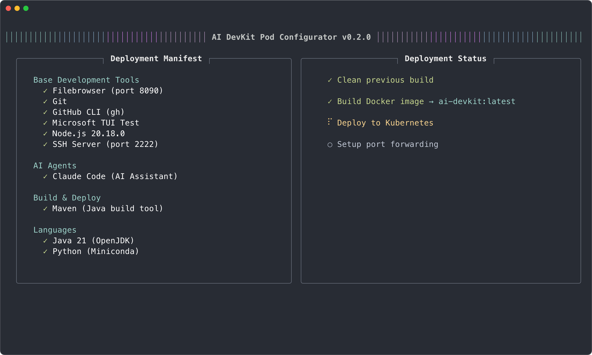

# AI DevKit Pod Configurator

A powerful, modular system for creating containerized development environments in Kubernetes with support for multiple programming languages, build tools, and AI coding assistants.


## 📖 Documentation

- **[Architecture Overview](docs/architecture.md)** - System design and component structure
- **[Creating Components](docs/components.md)** - Build your own custom components
- **[Theme Customization](docs/themes.md)** - Customize the TUI appearance
- **[Troubleshooting](docs/troubleshooting.md)** - Common issues and solutions
- **[Roadmap](docs/roadmap.md)** - Future plans and enhancements

### For Contributors
- **[Developer Guide](docs/developer.md)** - Contributing code and creating pull requests
- **[Maintainer Guide](docs/maintainer.md)** - Release management and repository maintenance

## 🎯 Overview

AI DevKit Pod Configurator provides a beautiful TUI (Terminal User Interface) for selecting and deploying customized development environments in Kubernetes. Each environment is built from a minimal Ubuntu base with only the components you need.

### Key Features

- 🎨 **Beautiful TUI** - Interactive component selection with theme support
- 🧩 **Modular Architecture** - Add only what you need: languages, tools, AI assistants
- 🤖 **AI Assistant Support** - Optional Claude Code integration
- 🔧 **Language Support** - Python, Java, Go, Rust, Ruby, Scala, Kotlin, and more
- 📦 **Build Tools** - Maven, Gradle, SBT with optional Nexus proxy support
- 🧪 **TUI Testing** - Microsoft TUI Test pre-installed for testing terminal apps
- 💾 **Persistent Storage** - Your code and configuration persist across restarts
- 🌐 **Web File Manager** - Built-in Filebrowser for easy file management
- 🔒 **Secure** - Runs as non-root user with proper isolation

## 📸 Screenshots

### Component Selection Interface

*Interactive TUI for selecting development tools and languages*

### Deployment Status Dashboard

*Real-time deployment progress with animated status indicators*

### Development Environment

*Inside the configured container with your selected tools ready to use*

## 🚀 Quick Start

### Prerequisites

- Kubernetes cluster (k3s, minikube, Colima, or any Kubernetes distribution)
- kubectl configured to access your cluster
- Docker or compatible container runtime
- For macOS users: [Colima](https://github.com/abiosoft/colima) is recommended

### macOS Quick Setup with Colima

```bash
# Install Colima
brew install colima kubectl

# Start Colima with Kubernetes
colima start --kubernetes --cpu 4 --memory 8

# Verify setup
kubectl get nodes
```

### Basic Usage

```bash
# Clone the repository
git clone https://github.com/ehausig/ai-devkit-pod-configurator.git
cd ai-devkit-pod-configurator

# Make scripts executable
chmod +x *.sh

# (Optional) Configure git credentials for automatic injection
./configure-git-host.sh

# Build and deploy with interactive component selection
./build-and-deploy.sh

# Access your development environment
ssh devuser@localhost -p 2222
# Password: devuser
```

## 🎮 Using the Component Selector

When you run `./build-and-deploy.sh`, an interactive TUI appears:

- **↑/↓** or **j/k** - Navigate components
- **←/→** or **h/l** - Switch pages
- **SPACE** - Select/deselect component
- **TAB** - Switch between catalog and selected items
- **ENTER** - Build with selected components
- **q** - Quit

The selector shows:
- ✓ Selected components
- ○ Available components
- Dependencies and conflicts
- Real-time build status with animations

## 🔐 Git Configuration

Configure git credentials once on your host machine:

```bash
./configure-git-host.sh
```

This creates an isolated git configuration that's automatically injected into your containers, including:
- Git user name and email
- GitHub Personal Access Token
- GitHub CLI authentication

## 📁 Accessing Your Environment

### SSH Access

After deployment completes, the build script automatically sets up port forwarding:

```bash
# Connect to your development environment
ssh devuser@localhost -p 2222
# Password: devuser
```

### Web File Manager

Access the built-in Filebrowser at [http://localhost:8090](http://localhost:8090)
- Default credentials: admin/admin (change after first login!)
- Upload/download files through the web interface
- Edit files directly in the browser

## 🧹 Disk Management

### Colima Disk Cleanup

Colima uses a virtual machine with a fixed disk size. Over time, Docker images and containers can fill up this disk, causing deployment failures.

**The Problem**: When Colima's disk fills up, you'll see errors like:
- "No space left on device"
- Image pull failures
- Build failures

**The Solution**: The `cleanup-colima.sh` script helps reclaim disk space:

```bash
# Check what can be cleaned (dry run)
./cleanup-colima.sh --check

# Clean up disk space
./cleanup-colima.sh

# Force cleanup without prompts
./cleanup-colima.sh --force
```

**⚠️ CRITICAL WARNING**: 
- **DO NOT USE** the `--overlay2` option - it will corrupt Docker
- If you need to completely reset, delete and recreate the Colima VM:
  ```bash
  colima delete
  colima start --kubernetes --cpu 4 --memory 8 --disk 100
  ```

## 📚 Creating Custom Components

Components are self-contained YAML files that define how to install and configure tools. See [Creating Components](docs/components.md) for detailed instructions.

### Basic Component Structure

```yaml
id: MY_COMPONENT
name: My Component Name
version: "1.0.0"
group: component-group
requires: []
description: What this component does
installation:
  dockerfile: |
    # Installation commands
    RUN apt-get update && apt-get install -y my-tool
```

### Component Documentation (Optional)

Components can include markdown documentation that gets injected into LLM system prompts:

```markdown
# components/category/my-component.md

#### My Component Name

**Getting Started**:
```bash
# How to use this component
my-tool --help
```

## 🤝 Contributing

We welcome contributions! Please see our [Developer Guide](docs/developer.md) for information on:
- Setting up your development environment
- Creating feature branches
- Writing tests
- Submitting pull requests

For maintainers, see the [Maintainer Guide](docs/maintainer.md) for release procedures.

## 💖 Support This Project

If you find AI DevKit Pod Configurator useful, please consider supporting its development:

☕ **[Buy me a coffee](https://buymeacoffee.com/ehausig)**

Your support helps maintain and improve this project. Thank you! 🙏

## 📄 License

This project is licensed under the MIT License - see the [LICENSE](LICENSE) file for details.

## 🙏 Acknowledgments

This project builds upon excellent work from these organizations and projects:

### Core Technologies

- **[Claude Code](https://www.anthropic.com/claude-code)** by [Anthropic](https://www.anthropic.com) - AI coding assistant that lives in your terminal
  - Claude is a trademark of Anthropic PBC
  - [Documentation](https://docs.anthropic.com/en/docs/claude-code/overview) | [GitHub](https://github.com/anthropics/claude-code) | [npm](https://www.npmjs.com/package/@anthropic-ai/claude-code)
  
- **[Microsoft TUI Test](https://github.com/microsoft/tui-test)** - End-to-end terminal testing framework
  - Built and maintained by Microsoft
  - Provides rich API for testing terminal applications across platforms
  
- **[Ubuntu](https://ubuntu.com)** - The base operating system (22.04 LTS)
  - Copyright © Canonical Ltd.
  
- **[Kubernetes](https://kubernetes.io)** - Container orchestration platform
  - Originally designed by Google, now maintained by the Cloud Native Computing Foundation

### Development Tools

- **[Docker](https://www.docker.com)** - Container platform
- **[Colima](https://github.com/abiosoft/colima)** - Container runtime for macOS
- **[Git](https://git-scm.com)** - Version control system
- **[GitHub CLI](https://cli.github.com)** - GitHub's official command line tool
- **[Filebrowser](https://filebrowser.org)** - Web-based file management

### Languages and Runtimes

All programming language implementations retain their respective copyrights and licenses:
- Python, Node.js, Java (OpenJDK), Go, Rust, Ruby, and others

### Special Thanks

- The open source community for continuous improvements and contributions
- All beta testers who provided valuable feedback
- Contributors who help improve this project

---

Created with ❤️ by [Eric Hausig](https://github.com/ehausig)
