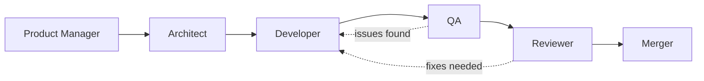

# Claude Code Autonomous Development System

An AI-powered autonomous software development system that leverages Claude Code's sub-agent architecture to design, implement, test, review, and release software projects with minimal human intervention.

## Overview

This system orchestrates specialized AI agents through a complete software development lifecycle:

- **Product Manager** - Requirements analysis and user story creation
- **Architect** - System design and technical planning
- **Developer** - Implementation using Test-Driven Development (TDD)
- **QA** - Comprehensive testing with real services
- **Reviewer** - Code quality and security review
- **Merger** - Release management and deployment

## How It Works

The system uses an event-driven architecture with:

1. **Sub Agents** - Each persona is a specialized Claude Code sub-agent with its own context
2. **Journal** - `~/workspace/JOURNAL.md` maintains state across agents
3. **Stop Hook** - Automatically continues the workflow by reading NEXT_AGENT directives
4. **Autonomous Flow** - Agents delegate to each other without manual intervention

## Quick Start

1. Start Claude Code:
   ```bash
   claude
   ```

2. Describe your project:
   ```
   Create a REST API for managing a todo list with CRUD operations
   ```

3. Initialize the autonomous system:
   ```
   /init-autonomous
   ```

4. The system will automatically progress through all development phases

## Available Commands

- `/init-autonomous` - Start a new autonomous development project
- `/show-journal` - View the development progress and agent activity
- `/event-query [type]` - Query specific events from the journal

## Agent Workflow



### Product Manager
- Analyzes vague requirements
- Creates detailed user stories
- Defines success metrics
- Sets technical constraints

### Architect
- Designs system architecture
- Selects technology stack
- Creates API specifications
- Plans data models

### Developer
- Implements using TDD
- Writes tests first
- Achieves 80%+ coverage
- Documents code

### QA
- Tests with real services (no mocks)
- Performs integration testing
- Validates performance
- Documents bugs clearly

### Reviewer
- Reviews code quality
- Checks security
- Verifies architecture compliance
- Provides actionable feedback

### Merger
- Creates releases
- Updates documentation
- Tags versions
- Completes development cycle

## Journal Structure

The journal tracks all activities:

```
2024-01-20T10:00:00Z | PROJECT_INIT | Starting todo API
2024-01-20T10:00:01Z | WORK_ASSIGNED | PRODUCT_MANAGER | Define requirements
2024-01-20T10:00:02Z | NEXT_AGENT | system | product-manager | Requirements needed
2024-01-20T10:15:00Z | DECISION | architect | Using PostgreSQL for persistence
2024-01-20T10:30:00Z | FILE_CREATED | developer | src/api/todos.py
```

## Key Features

- **Fully Autonomous** - Requires no manual intervention after initialization
- **Context Isolation** - Each agent has its own context window
- **Flexible Workflow** - Supports non-linear flows (e.g., reviewer sending work back)
- **Real Testing** - QA always uses actual services, never mocks
- **Complete Visibility** - Journal provides full audit trail
- **Quality Focus** - TDD, code review, and comprehensive testing built-in

## Configuration

The system is configured through:

- **Settings** - `claude-settings.json.template` with Stop hook
- **Sub Agents** - Individual agent definitions in `agents/`
- **Commands** - Utility commands in `commands/`
- **Hook** - `autonomous-continue.sh` for autonomous flow

## Development Principles

1. **Requirements First** - Clear requirements prevent costly revisions
2. **Test-Driven** - Tests written before implementation
3. **Real Services** - Integration tests use actual databases/APIs
4. **Clean Architecture** - Separation of concerns enforced
5. **Continuous Progress** - Automatic handoffs between agents

## Example Projects

The system can build:

- REST APIs with CRUD operations
- CLI tools with argument parsing
- Web scrapers with data processing
- Real-time applications with WebSockets
- Microservices with event-driven architecture

## Troubleshooting

### System Stops Unexpectedly
- Check journal for `CYCLE_COMPLETE` - system stops when done
- Look for `stop_hook_active` events to prevent loops
- Verify Stop hook is properly configured

### Agent Not Starting
- Ensure work is assigned in journal
- Check NEXT_AGENT directive exists
- Verify agent file exists in `~/.claude/agents/`

### Tests Failing
- QA uses real services - ensure Docker/services are running
- Check database connections
- Verify API endpoints are accessible

## Contributing

To modify or extend the system:

1. **Add New Agents** - Create agent definition in `agents/`
2. **Modify Workflow** - Update NEXT_AGENT logic in agents
3. **Add Commands** - Create new command files in `commands/`
4. **Enhance Agents** - Improve prompts and decision logic

## Technical Details

- Built for Claude Code with sub-agent support
- Uses bash for scripting (Python-free)
- Event-sourced architecture via journal
- Leverages Claude Code's Stop hook for automation
- Supports all major programming languages

## License

This component is part of the AI DevKit Pod Configurator project.
