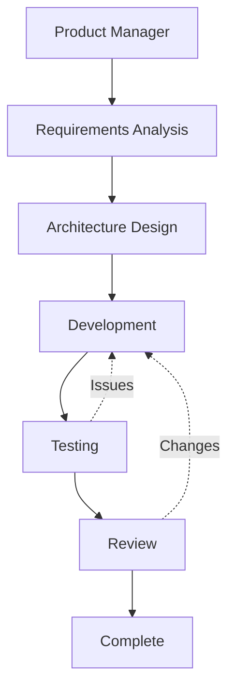

# Claude Code Component

An AI-powered coding assistant integrated into the AI DevKit Pod Configurator. This component provides Claude Code with a Team Topologies-based autonomous development system for orchestrating complex software projects.

## Overview

Claude Code is configured with:
- Custom settings optimized for development workflows
- Team Topologies-based sub-agents for specialized tasks
- Kanban-style project management commands
- Utility scripts for development automation
- Dynamic permission aggregation from selected components

## Component Structure

```
claude-code/
├── claude-code.yaml          # Component definition
├── claude-code-setup.sh      # Pre-build configuration script
├── CLAUDE.md.template        # Product Manager orchestration guide
├── claude-settings.json.template     # Global settings
├── claude-user-local-settings.json.template  # Workspace settings
├── agents/                   # Team Topologies sub-agents
├── commands/                 # Utility commands
├── scripts/                  # Helper scripts
└── hooks/                    # Event hooks (optional)
```

## Team Topologies Structure

The system implements Team Topologies patterns with specialized agents:

### Stream-Aligned Team
- **Feature Developer** - Implements features and business logic
- **QA Engineer** - Tests and validates implementations

### Platform Team  
- **Platform Engineer** - Handles setup, build, deployment
- **Database Engineer** - Designs data models and schemas

### Enabling Team
- **API Designer** - Creates API specifications
- **Security Specialist** - Reviews security aspects
- **Performance Engineer** - Optimizes performance
- **Solution Architect** - High-level system design
- **Cloud Architect** - Cloud infrastructure design
- **Data Architect** - Enterprise data architecture

### Complicated Subsystem Team
- **Integration Specialist** - Handles third-party integrations
- **Algorithm Developer** - Implements complex algorithms
- **Requirements Analyst** - Interactive requirements gathering

## How It Works

### 1. Installation Process

When Claude Code is selected in the build system:

1. **Pre-build Script** (`claude-code-setup.sh`):
   - Generates `component-imports.txt` from selected components
   - Aggregates command permissions from all components
   - Creates dynamic `user-local-settings.json` with permissions
   - Copies agent definitions and command utilities

2. **Docker Build**:
   - Installs Claude Code globally via npm
   - Injects all configuration files to `/tmp/`

3. **Runtime Setup** (entrypoint):
   - Moves files to proper locations in `~/.claude/`
   - Sets up documentation imports for AI context
   - Configures scripts in PATH

### 2. Autonomous Development Flow

The system uses a Product Manager (main Claude Code thread) to orchestrate development:



### 3. Kanban Card System

Work is tracked through cards with states:
- **BACKLOG** - Not started
- **BREAKDOWN_STARTED/ENDED** - Requirements analysis
- **IN_PROGRESS_STARTED/ENDED** - Active development
- **BLOCKED** - Waiting on dependencies
- **VALIDATION_STARTED/ENDED** - Testing
- **DONE** - Completed

## Configuration

### Settings Files

The component creates two settings files:

1. **`~/.claude/settings.json`** - Global settings:
   ```json
   {
     "theme": "dark",
     "verbose": true,
     "includeCoAuthoredBy": true,
     "env": {
       "CLAUDE_BASH_MAINTAIN_PROJECT_WORKING_DIR": "0"
     }
   }
   ```

2. **`/home/devuser/workspace/.claude/user-local-settings.json`** - Dynamic permissions:
   ```json
   {
     "permissions": {
       "allow": [
         "Bash(python:*)",
         "Bash(npm:*)",
         // Aggregated from all selected components
       ],
       "deny": []
     }
   }
   ```

### Command Permissions

Components can define permissions in their YAML:

```yaml
command_permissions:
  allow:
    - "Bash(npm:*)"
    - "Bash(node:*)"
    - "Read(*.js)"
  deny:
    - "Bash(rm -rf /*)"
```

These are automatically aggregated during build and injected into Claude Code's configuration.

## Usage

### Starting a Project

1. Create requirements:
   ```bash
   cat > ~/workspace/PROMPT.md << 'EOF'
   # Project: My Application
   
   Build a REST API with authentication...
   EOF
   ```

2. Initialize autonomous development:
   ```
   /init-autonomous
   ```

3. Monitor progress:
   ```
   /show-journal
   /kanban-status
   ```

### Available Commands

- `/init-autonomous` - Start from PROMPT.md
- `/show-journal` - View development timeline
- `/kanban-status` - Current card states
- `/event-query TYPE` - Filter journal events
- `/create-prompt` - Interactive requirements gathering

### Manual Control

You can also manually delegate to agents:
```
Use the api-designer agent to create OpenAPI specification for the user service
```

## Sub-Agents

Each agent has:
- Specific expertise domain
- Custom system prompt
- Optional tool restrictions
- Clear handoff patterns

Example agent structure:
```markdown
---
name: feature-developer
description: Stream-aligned team member implementing features
tools: Read, Write, Edit, Bash, Glob
---

You are the FEATURE DEVELOPER...
```

## Scripts and Utilities

### Journal Logging
```bash
journal-log.sh EVENT_TYPE ACTOR "Description"
```

### Card ID Generation
```bash
CARD_ID=$(generate-card-id.sh)
```

## Integration with Components

### Documentation Imports

Component documentation (`.md` files) are:
1. Copied to `~/.claude/docs/`
2. Referenced in CLAUDE.md via `@import`
3. Available to Claude for context

Example:
```markdown
## Languages
- **Python 3.11** @/home/devuser/.claude/docs/python-3.11.md
```

### Dynamic Configuration

The pre-build script:
1. Detects all selected components
2. Extracts their permissions
3. Generates appropriate configuration
4. Ensures compatibility

## Troubleshooting

### Common Issues

1. **Claude Code not starting**: Check npm installation in build log
2. **Missing permissions**: Verify component has `command_permissions` defined
3. **Agents not working**: Ensure `/init-autonomous` was run first
4. **Journal not updating**: Check write permissions on JOURNAL.md

### Debug Mode

View Claude Code debug output:
```bash
claude --debug
```

## Development

### Adding New Agents

1. Create `.md` file in `agents/`
2. Define frontmatter with name, description, tools
3. Write detailed system prompt
4. Test delegation patterns

### Extending Commands

1. Create `.md` file in `commands/`
2. Define command behavior
3. Update command list in documentation

### Custom Hooks

While the autonomous system doesn't rely on hooks, you can add them for specific workflows in the `hooks/` directory.

## Best Practices

1. **Clear Requirements**: Start with detailed PROMPT.md
2. **Let PM Orchestrate**: Don't manually control agents unless needed
3. **Monitor Progress**: Use `/show-journal` regularly
4. **Trust the Process**: Agents will handle handoffs automatically
5. **Component Selection**: Choose components that match your project needs

## Technical Notes

- Claude Code is installed globally to `/home/devuser/.npm-global/`
- All configuration is user-specific (not system-wide)
- The system works without hooks through explicit orchestration
- JOURNAL.md serves as the single source of truth
- Each agent operates in its own context window
