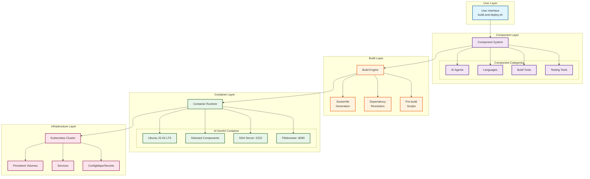
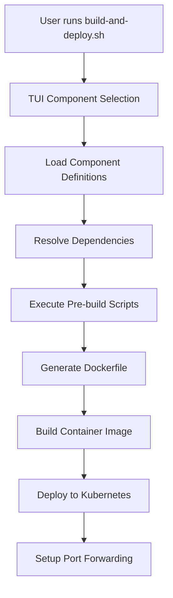

# Architecture Overview

This document describes the architecture and design of the AI DevKit Pod Configurator.

## System Overview

The AI DevKit Pod Configurator is a modular system for creating customized development environments in Kubernetes. It uses a component-based architecture where users can select exactly what tools they need.

## High-Level Architecture



## Core Components

### 1. Terminal User Interface (TUI)

The TUI is built into `build-and-deploy.sh` and provides:
- Interactive component selection
- Real-time build status
- Theme support
- Keyboard navigation
- Multi-page catalog browsing

**Key Features:**
- Written in pure Bash for portability
- Supports vim-style navigation (hjkl)
- Dynamic pagination based on terminal size
- Visual feedback for dependencies and conflicts

### 2. Component System

Components are the building blocks of the system. Each component is:
- Self-contained YAML definition
- Optional markdown documentation
- Optional pre-build script
- Dependency aware

**Component Structure:**
```
components/
├── agents/
│   ├── .category.yaml
│   ├── claude-code.yaml
│   └── claude-code.md
├── languages/
│   ├── .category.yaml
│   ├── python-miniconda.yaml
│   └── python-miniconda.md
└── build-tools/
    ├── .category.yaml
    ├── maven.yaml
    └── maven.md
```

### 3. Build Engine

The build engine handles:
1. **Component Loading**: Parses YAML files and builds dependency graph
2. **Dependency Resolution**: Topological sort for correct installation order
3. **Dockerfile Generation**: Creates custom Dockerfile from base + components
4. **Pre-build Scripts**: Executes component-specific setup scripts
5. **Documentation Aggregation**: Collects component markdown files

### 4. Container Image

Built on Ubuntu 22.04 LTS with:
- **Base Tools**: Git, SSH server, file manager
- **Development User**: Non-root `devuser` with sudo access
- **Persistent Paths**: 
  - `/home/devuser/workspace` - Code and projects
  - `/home/devuser/.config/ai-devkit` - Configuration
- **Service Ports**:
  - 2222: SSH server
  - 8090: Filebrowser web UI

### 5. Kubernetes Deployment

The deployment includes:
- **Main Pod**: Development environment container
- **Sidecar**: Filebrowser for web-based file management
- **Persistent Volumes**: For workspace and configuration
- **Services**: ClusterIP for SSH and Filebrowser
- **ConfigMaps**: Nexus proxy configuration (optional)
- **Secrets**: SSH keys and git credentials

## Data Flow

### Build Process



### Component Installation Flow

1. **Selection**: User selects components in TUI
2. **Validation**: Check dependencies and conflicts
3. **Sorting**: Topological sort by dependencies
4. **Pre-build**: Run component pre-build scripts
5. **Generation**: Create Dockerfile with installations
6. **Building**: Docker builds the image
7. **Deployment**: Image deployed to Kubernetes

## Security Architecture

### Container Security
- Runs as non-root user (`devuser`)
- SSH requires authentication
- Minimal base image
- No unnecessary privileges

### Secret Management
- SSH host keys in Kubernetes secrets
- Git credentials isolated to container
- Optional host credential injection
- Proper file permissions (600)

### Network Security
- Services use ClusterIP (not exposed externally)
- Port forwarding for local access only
- Optional network policies
- Filebrowser requires authentication

## Extension Points

### Adding New Components

1. Create YAML definition in appropriate category
2. Optional: Add markdown documentation
3. Optional: Create pre-build script
4. Define dependencies via `requires` field

### Custom Themes

Themes are defined in `build-and-deploy.sh`:
- Color schemes for TUI elements
- Icon sets
- Border styles
- Status indicators

### Pre-build Scripts

Components can include pre-build scripts that:
- Generate configuration files
- Download additional resources
- Create documentation aggregates
- Set up component-specific structures

## Configuration Management

### Host Configuration
- Git credentials via `configure-git-host.sh`
- Stored in `~/.ai-devkit/`
- Injected as Kubernetes secrets

### Container Configuration
- Environment variables for tools
- Dotfiles in home directory
- Package manager configurations
- Persistent across restarts

### Nexus Proxy Support (Optional)
- Proxy configuration
- ConfigMaps for each package manager
- Environment variables for tools
- Transparent to components

## Performance Considerations

### Build Optimization
- Minimal base image
- Layer caching
- Conditional installations
- Cleanup after each component

### Runtime Performance
- Resource limits in Kubernetes
- Efficient file watching
- Lazy loading of tools
- Minimal background processes

## Monitoring and Debugging

### Build Logs
- Detailed logging to `build-and-deploy.log`
- Component installation tracking
- Error capture and reporting

### Runtime Debugging
- SSH access for troubleshooting
- Container logs via kubectl
- Filebrowser for file inspection
- Standard Kubernetes tooling

## Technical Decisions

### Why Bash for TUI?
- No additional dependencies
- Works on all POSIX systems
- Direct terminal control
- Fast and responsive

### Why YAML for Components?
- Human readable
- Simple parsing
- Widely understood
- Supports multiline strings

### Why Ubuntu Base?
- Excellent package availability
- Long-term support (LTS)
- Familiar to developers
- Good container support

### Why Kubernetes?
- Persistent storage management
- Service discovery
- Secret management
- Platform agnostic
